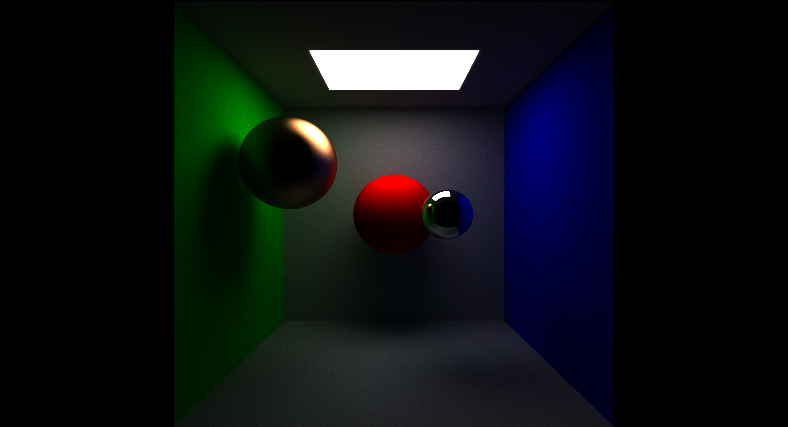

# gl-pathtracer

Pathtracer implemented with an OpenGL compute shader.

## Building and usage

To build, run

`mkdir build && cd build`

`cmake ..`

`make`

in the project root directory.

Run the resulting binary with `./bin/pt`. The program will incrementally sample the scene until a maximum number of samples is reached. Exit the program at any point by pressing Esc.

## TODO

* Adjust viewport size based on current window size.
* Input file parsing, removing the need for hardcoding the scene in source code.
* Debug dielectric materials.
* CPU reference implementation for pathtracing.
* Support for textures.
* Support for OBJ files or similar.
* Importance sampling for light sources.
